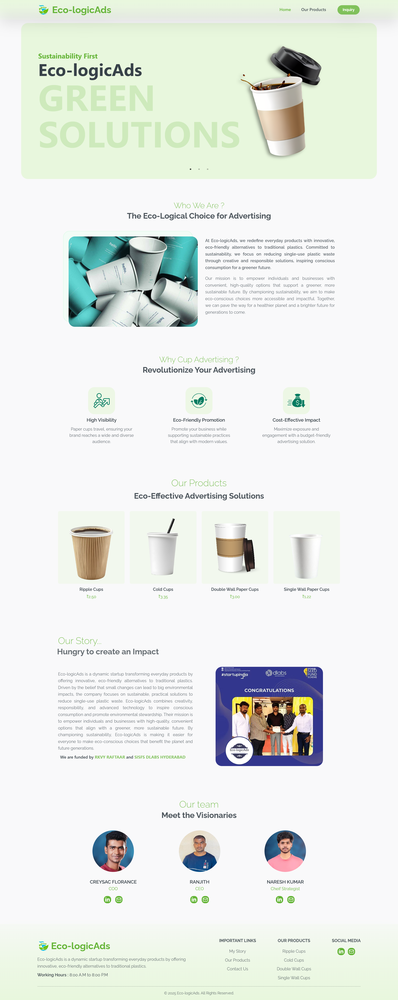
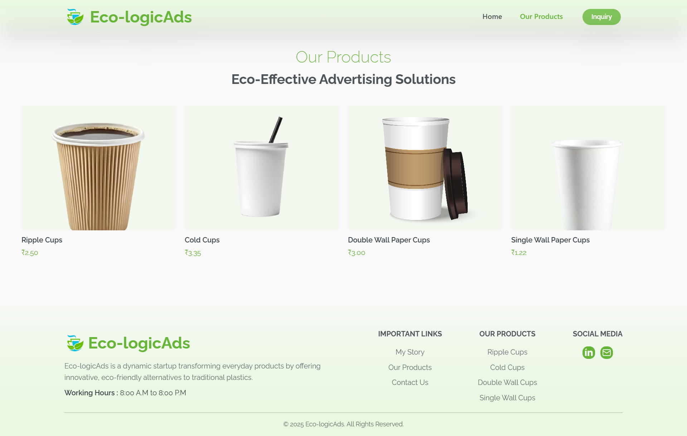
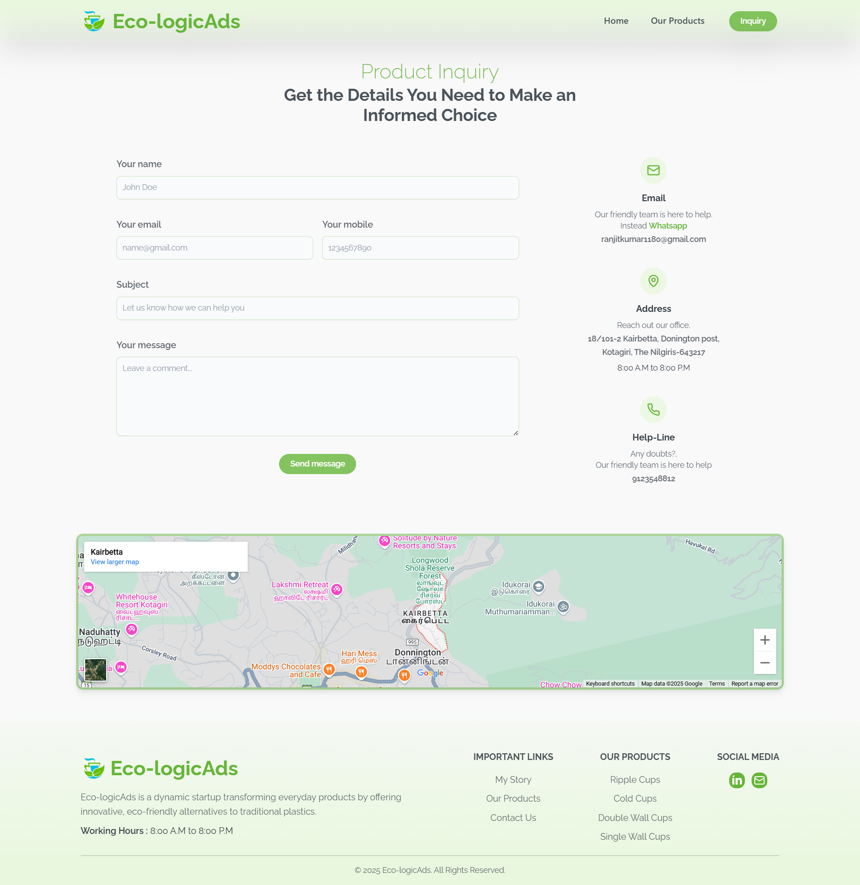

# Ecologic-Ads

A visually engaging website that introduces a unique blend of sustainability and advertising through eco-friendly paper cups. Ecologic-Ads offers businesses an innovative way to promote their brand while championing environmental responsibility.

🌐 Live Site: [https://ecologicads.kayteegee.in](https://ecologicads.kayteegee.in)

---

## Demo Outcomes

---

## 🌱 About the Project

Ecologic-Ads is a digital platform that showcases eco-conscious advertising solutions using printed paper cups. The site presents a sleek and responsive design to help businesses explore this sustainable marketing opportunity.

---

### ✨ Key Features

- **Product Gallery**: Explore a curated collection of eco-friendly branded paper cups.
- **Business Inquiry Form**: Connect with the Ecologic-Ads team through an easy-to-use contact form.
- **Mobile Responsive Design**: Seamless user experience across all devices.
- **Client Testimonials and Brand Logos**: See how other brands are embracing sustainable advertising.

---

### 🛠️ Tech Stack

- **Frontend Framework**: React.js
- **Styling**: Tailwind CSS
- **Animations**: Framer Motion

---
